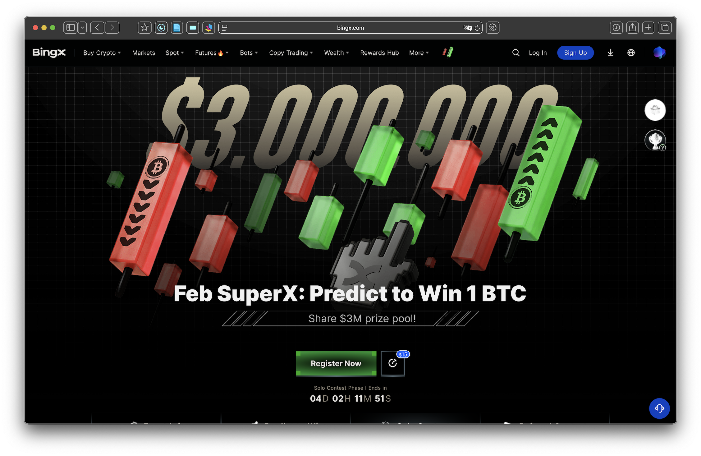
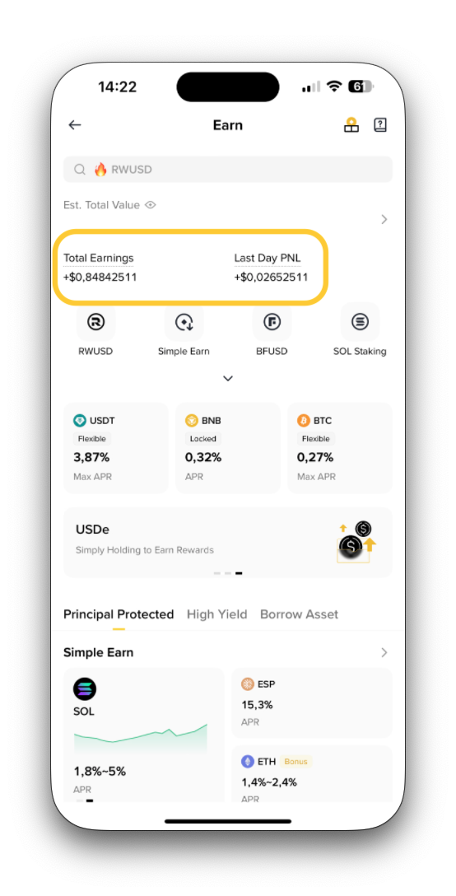
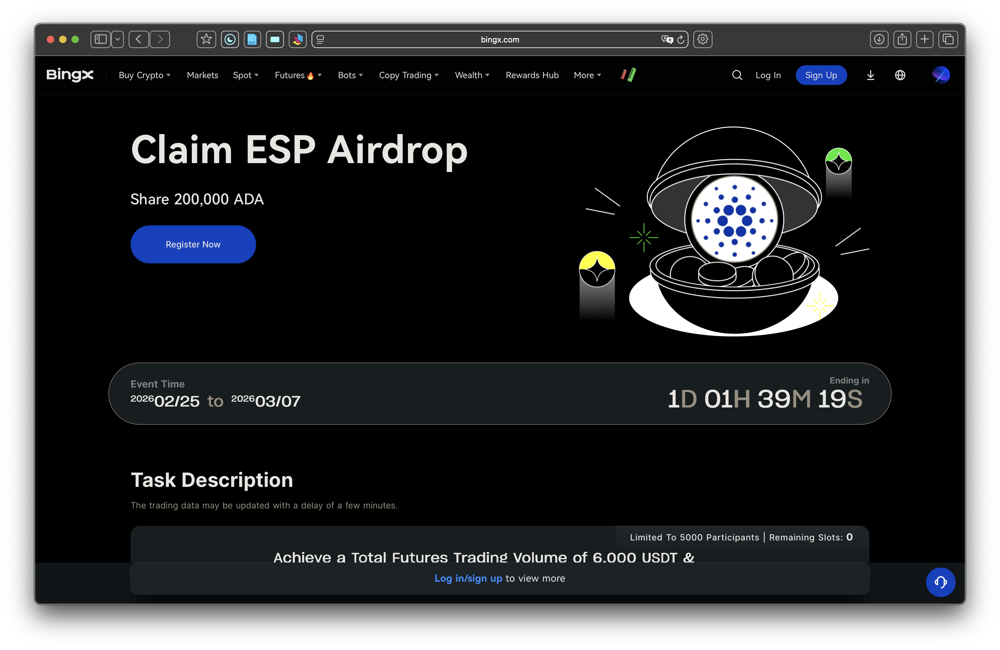
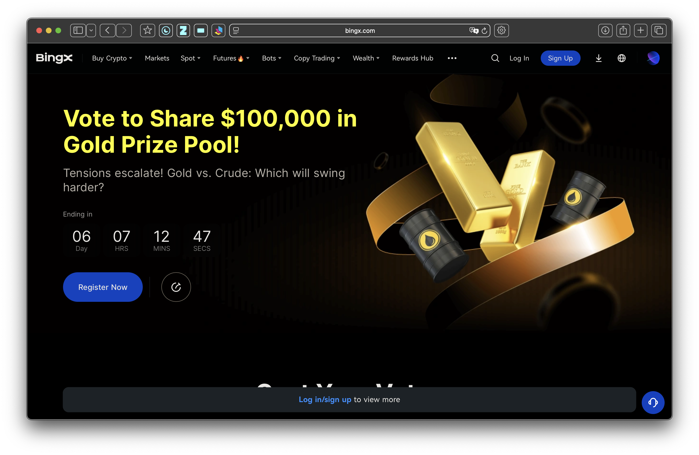
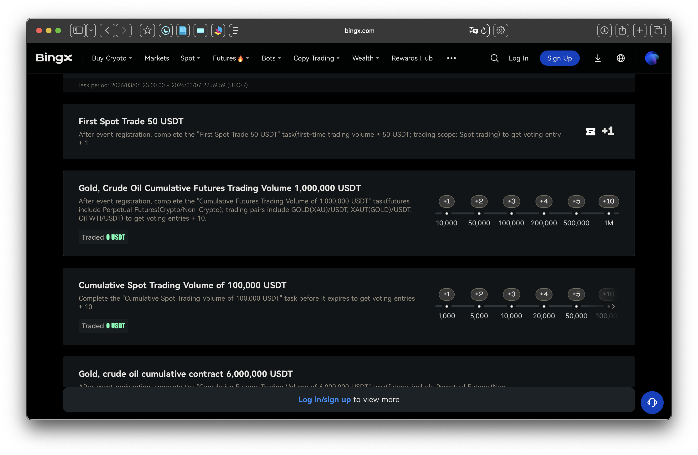

## Binance {#flywheel}
The overiew of Binance Retention Cycle

<iframe src="binance.html" style="border:none; width:100%; height:70vh;" scrolling="no"></iframe>

---

## Onboard {.scrollable}
*Benefit for each referrer and referee*

### Referral Program

**Referral Lite**: Simple one-time bonuses.

- Friend signs up + buys >$50 crypto + trades >$100. **Both** get up to **$100** rebate. Up to **$1,000** total.

**Referral Pro**: Ongoing passive income.

- Earn up to **50%** commission on friends' trading fees.
- Share up to **20%** fee discount with friend.
- Commissions paid hourly.

 

### Learn & Earn  
*Earn while learning*
  
**Mechanism**: Sign up account → pass KYC → complete courses → pass quiz → rewarded with a token voucher. $2 - $10/course.  

**Idea for Coin98**: Instead of writing blogs to introduce partners/features → *What if* we convert the blogs into short courses? User earn if finish quiz → Deeper interactions than blogs.

---

## Earn {.scrollable}

*Offer wide variety of earn products, fit for beginner as well as advanced trader*

 

### Simple Earn
*Low risk, low yield*

User lends Binance principal, Binance uses that money for internal operations. Users earn rewards, calculated as **APR**.

 

### Advanced Earn 
*Maximize earnings for corresponding risks. Suited for advanced traders*

**Dual Investment**: High yield product — buy low or sell high at desired price and date, while earning rewards no matter which direction the market goes.

**Smart Arbitrage**: Arbitrage between perpetual futures and spot equivalents, leveraging the funding rate mechanism.

**Discount Buy**: Buy cryptocurrency at a discount or earn rewards on your investment.

**On-chain Yields**: Participate in various on-chain protocols and earn rewards directly through Binance account.

---

## Launchpool, Megadrop, and Alpha Programs {.scrollable}

- **Launchpool**: Stake BNB/FDUSD/USDC → *Earn* new project tokens proportionally. Unlock anytime.

- **Megadrop**: Lock BNB in Simple Earn + Complete quests → *Earn* airdrops from early Web3 projects.

- **Alpha (Points)**: Earn daily points via balance tiers + trading volume → *Earn* exclusive airdrops, TGEs, Alpha Box.

- *Idea*: Stake/hold/trade → Free early tokens → More activity → Loyalty & retention.

---

## CreatorPad and Binance Square Rewards

Users (especially creators) can unlock token rewards by participating in content creation, engagement, or campaigns on Binance Square. This fosters community activity and retention through incentives.

---

## Ideas for Coin98 {.scrollable}

- **Learn&Earn**: From Binance Learn&Earn, we can update the blogs of Coin98. Instead of writing blogs to introduce partners/features → *What if* we convert the blogs into short courses? User earn if finish quiz → Deeper interactions than blogs.

- **Earn**: *Coin98 PowerPool* is the most similar to Binance earn, but only focus on NE's token, and has stopped earning. *What if* we collab with different lending/ liquidity protocols, acting as a abstracting, reliable central hub for users to earn? That way we can hook up new user with this no-risk earning feature.

- **Earning Hub**: Instead of Stake Master for only NE's tokens, what if we aggregate all yields products into UI, abstracting away the providers?

---

# BingX

---

## BingX Retention Program {.scrollable}



### 1. BingX Shards Loyalty Program
*Long-term retention program*

**How it works**

* Users earn **Shards points** by:

  * KYC verification
  * Depositing funds
  * Trading
  * Completing tasks
  * Participating in campaigns
  * Inviting new users
* Accumulated Shards determine the **user’s level and status** on the platform

**Retention mechanisms**

* Gamified leveling system
* Continuous engagement tasks
* Status-based benefits

**Rewards unlocked**

* Token airdrops
* Early access to token launches (TGE)
* Trading fee discounts
* VIP privileges
* APR boosters and special wealth products
* Event passes and merchandise

This program is designed as an **ongoing engagement ecosystem rather than a one-time promotion**. 

 

### 2. Rewards Hub (Daily & Task-Based Incentives)
*Central engagement system for both new and existing users.*

**Key retention features**

* Daily check-in rewards
* Mystery boxes containing:

  * trading bonuses
  * rebate vouchers
  * trial funds

* **Task-based missions** such as trading volume or feature usage.

**Example tasks**
- Weekly spot trading volume targets
- Platform activity missions
- Campaign participation

This system encourages **habitual platform usage** (daily logins + trading activity).

 

### 3. **VIP Program + Monthly Airdrops**
*VIP-tier incentives tied to trading activity.*

**Examples of ongoing benefits**

* Monthly airdrop distributions
* Trial funds (e.g., 300 USDT trading vouchers)
* Hot token airdrops
* APR booster vouchers
* Fee subsidies for fiat-to-crypto conversions. ([bingxservice.zendesk.com][4])

The rewards often scale based on **VIP level**, motivating users to maintain high trading volume.

 

### 4. **New User + Trading Challenge Rewards**
*onboarding incentives that transition into retention programs*

Examples include:

* Mystery box rewards for completing beginner tasks
* Trading challenges with reward pools
* Bonus funds for first trades

Some campaigns offer **up to ~12,100 USDT rewards** through task completion and trading activities. ([CoinCodeCap][5])

These programs push users from **signup → active trading**.

 

### 5. **Referral / Affiliate Programs**
*Network-based incentives*

Examples:

* Referral commissions
* Affiliate/KOL reward campaigns
* Copy trading recommendation rewards

These programs reward users for **bringing new traders and maintaining trading activity**. ([Bingx Exchange][6])

 

### 6. **Copy Trading Ecosystem Incentives**
*Core feature that increase retention*

* Copy trading subsidy vouchers
* Trader recommendation rewards
* Profit-sharing programs for elite traders

These incentives encourage users to **stay engaged with the social trading ecosystem**.

---

## Summary: BingX Retention Flywheel

Most of BingX’s retention strategy can be grouped into **four engagement layers**:

| Layer                | Retention Mechanism      | Example            |
| -------------------- | ------------------------ | ------------------ |
| Gamification         | Points & leveling        | Shards             |
| Habit formation      | Daily tasks              | Rewards Hub        |
| Financial incentives | Trading rewards          | VIP airdrops       |
| Network effects      | Referrals & copy trading | Affiliate programs |

BingX relies heavily on **gamified rewards + trading incentives + social trading network effects** to retain users rather than only deposit bonuses.

---

## [Feb SuperX: Predict to win 1 BTC](https://bingx.com/en/activity/febsuperx?ch=bingx_appbanner&sourceType=63&themeType=2&code=QEF5ZS) {.scrollable}
[Ongoing]{.pill .golden}

*Biggest event of BingX in Feb & March*

<!-- {width=100%} -->

Consists of **Predict to Win**, **Solo Contest**, **Referral Contest**, and **Share & Earn** (social sharing/tasks)

### 1. **Predict to Win (BTC Daily Prediction)**
*Correct daily predictions will earn shares in the 1 BTC prize pool*

**Mechanism**: Users make daily predictions on BTC's price trend. Correct predictions earn entries or shares in the **1 BTC prize pool** and other rewards

**Why it works**: 

  * No barrier to join
  * Encourages daily logins and market analysis, boosting platform stickiness.

 

### 2. **Solo Contest (Trading Competition)**
*Trading leaderboard across different products, reward top performers*

**Mechanism**: Leaderboards including *Futures ROI* (Return on Investment), *Futures Trade Volume*, *Spot Trade Volume*.

**Why it works**:

- Cumulative valid spot and futures trading volume increase hype
- More volume, more participants > More rewards
   
 

### 3. **Referral Contest**
*Referral leaderboard, more valid referral > more rewards*

**Mechanism**: Each referee who register, complete KYC/trade, and meet volume requirements are counted as a valid ref. Rewards for top 10 referrers.

**Why it works**:

  - Works concurrently with on-going referral commissions
  - Simple and easy to complete

 

### 4. **Share & Earn / Tasks & Lucky Draws**
*Complete tasks for lucky draw*

**Mechanism**:  Complete event tasks (e.g., deposits, trades, social shares) for lucky draw entries—**every draw wins** something. 

**Rewards** include various vouchers: Token Voucher, Position Voucher (1x–10x leverage), Futures Bonus Voucher (1x–5x), Trial Fund Voucher (50% offset), Spot Rebate, Wealth APR Booster, Grid/Copy Trading subsidies.

**Why it works**:

- Social sharing tasks bring more traction to the program
- Rewards are in voucher, not real money
- Each draw ensure a rewards, regardless big or small

---

## [Claim ESP Airdrop](https://bingx.com/en/activity/general/7288217384?ch=banner_app&sourceType=63&code=QEF5ZS) {.scrollable}
[Ongoing]{.pill .golden}

*Part of Token Airdrop Rewards program, promote activity with newly listed tokens*

<!-- {width=100%} -->

**Mechanism**: Complete simple tasks:

- Futures Trading Volume of 6000 USDT
- Spot Trading Volume of 5,000 USDT

To earn share of 200,000 ADA.

---

## [0 Fee Special Wheel Carnival](https://bingx.com/en/activity/turntable/4428089792?sourceType=63&code=QEF5ZS) {.scrollable}
[Ongoing]{.pill .golden}

*Complete tasks for Lucky Draw*

<!-- {width=100%} -->

**Mechanism**: Complete tasks to earn draw entries, guarantee rewards (no blanks). Tasks such as:

- First Spot Trade 50 USDT
- First Futures Trade 200 USDT
- Accumulate Futures Trade Volume of 10,000 to 2,000,000 USDT
- Accumulate spot trading volume to earn up to 23 lucky draw chances

---

## [Vote to Share $100,000 in Gold Prize Pool!](https://bingx.com/en/activity/voteActivity/0271014970?ref=QEF5ZS&ch=banner_app) {.scrollable}
[Ongoing]{.pill .golden}

*Complete daily tasks to earn vote entries, prize pool unlocked based on participants*

<!-- {width=100%} -->

**Mechanism**: Complete daily tasks to have vote entries, vote either Crude Oil or Gold have bigger volatility. 

**Why it works**:

- Follow currently hot events
- "Vote" not bet, but same idea
- Prize pool based on participants -> More referrals
- Each task has different set of goals mechanisms. Some tasks is simple, complete in one go, while others have progress. 

<!-- {width=100%} -->

---

## Additionals {.scrollable}

### What are the pain points of users in crypto right now? 

1. *Seed Phrase & Private Key Anxiety*: Fear of losing seed phrase. No recovery if lost

2. *Gas Fees Confusion*: Not understanding why need native token just to transact

3. *Multi-Chain Fragmentation*: Users must manually switch chains, bridge assets across networks, understand different explorers and token standards

4. *Security & scams* — Phishing, impersonation, approval drainers, social engineering; losses estimated $14-17B+ in recent years, with AI-enabled tactics rising

5. *Lack of confidence* — 59% of non-owners cite no protection, cyber risks; even owners face hacks, rugs, and trust erosion

6. *UX & accessibility barriers* — Poor consumer-grade experiences, wallet setup friction, unclear value for everyday use

7. *Connecting wallet to malicious sites* and being hacked

8. *Failed Transactions* — Users don't understand why a transaction failed, why gas was deducted, or what error codes mean

9. *Asset Visibility Problems*: Users panic when tokens don't auto-display; They must manually add contract addresses

10. *Portfolio & PnL Tracking Difficulty*: No unified dashboard across chains; Hard to track cost basis

 

### What triggers a user to use DeFi wallet app?

1. *Interact* with a Specific dApp or Protocol

2. Seeking *Higher Yields* or Passive Earning in DeFi

3. Participating in *Early Token Launches* or *Airdrops*

4. Self-Custody

5. Multi-Chain or Cross-Chain Activity

6. Privacy

---

## Campaign Components {.scrollable}

### Camps 

| Name                       | Mechanism                                                                                               | Rewards                         | Ref                                                                                                                |
| -------------------------- | ------------------------------------------------------------------------------------------------------- | ------------------------------- | ------------------------------------------------------------------------------------------------------------------ |
| Predict/ Vote to win       | Complete tasks & earn voting entries. Each correct entries will have share in the winning rewards pool. | Entries to vote in rewards pool |                                                                                                                    |
| Wheel Carnival/ Lucky Draw | Complete task & earn draw entries. Each draw is reward-guarantee (no blank)                             | Entries to draw lucky wheel     | [BingX 0 Fee Special Wheel Carnival](https://bingx.com/en/activity/turntable/4428089792?code=QEF5ZS&sourceType=63) |
| Referral Leaderboard       | Refer new users. Referee must accomplish tasks (KYC, trading volume), then the referrer earn rewards.   | Tokens                          |                                                                                                                    |

 

### Tasks

| Name                     | Frequency  | Type    | Scope | Detail                                                                          | Mechanism                                                                                                                                                                                                                                                                                                     | Example                                                                                                                                                                                                                                                                                                  | Ref |
| -------------------------------- | ---------- | ------- | ----- | --------------------------------------------------------------------------------------------------- | ---------------------------------------------------------------------------------------------------------------------------------------------------------------------------------------------------------------------------------------------------------------------------------------------------------------------------------- | ------------------------------------------------------------------------------------------------------------------------------------------------------------------------------------------------------------------------------------------------------------------------------------------------------------------------------------ | --- |
| Baby One Time                    | Once       | Trading | Small | Done first trade with (small x) volume (Spot, Future, Contract)  Done first ... action in ... | - **Goal**: Baby, first step hooking up user into the event. Simple and easy to do, rewards is adequate, but may not enough to claim/ need to do bigger tasks to earn more. - **Structural**: Usually on top of the campaign                                                                                                    | **Gold, Crude Oil First Contract Trading 100 USDT** After event registration, complete the "First Futures Trade 100 USDT" task(first-time trading volume ≥ 100 USDT; trading scope: Perpetual Futures(Non-Crypto); trading pairs include: XAUT(GOLD)/USDT, Oil WTI/USDT, GOLD(XAU)/USDT) to get voting entries + 2.               |     |
| Ain't No Mountain High Enough    | Once       | Trading | Big   | Trade volume reach (big x) volume USDT                                                              | - **Goal**: Big milestone serving as big goal for campaign - **Structural**: Usually follow up a small task                                                                                                                                                                                                                     | **Gold, Crude Oil Daily Futures Trading 15,000 USDT**  Complete the "Trade Futures Daily" task (Daily futures trading volume ≥ 15,000 USDT; futures include Perpetual Futures(Non-Crypto/Crypto); trading pairs include GOLD(XAU)/USDT, XAUT(GOLD)/USDT, Oil WTI/USDT) before it expires to get voting entry + 1.              |     |
| Harder, Better, Faster, Stronger | Cumulative | Trading | Big   | Cumulative Trading Volume                                                                           | - **Goal**: Have progress tracking the cumulative trading volume, serve as the ladder, hooking user keep playing campaign to earn more rewards, connector from mini tasks to the big task. - **Structural**: After the mini task, before the big task. - **Rewards**: Unlocked step-by-step, where user earn biggest rewards | **Gold, Crude Oil Cumulative Futures Trading Volume 1,000,000 USDT**  After event registration, complete the "Cumulative Futures Trading Volume of 1,000,000 USDT" task(futures include Perpetual Futures(Crypto/Non-Crypto); trading pairs include GOLD(XAU)/USDT, XAUT(GOLD)/USDT, Oil WTI/USDT) to get voting entries + 10. |    |

