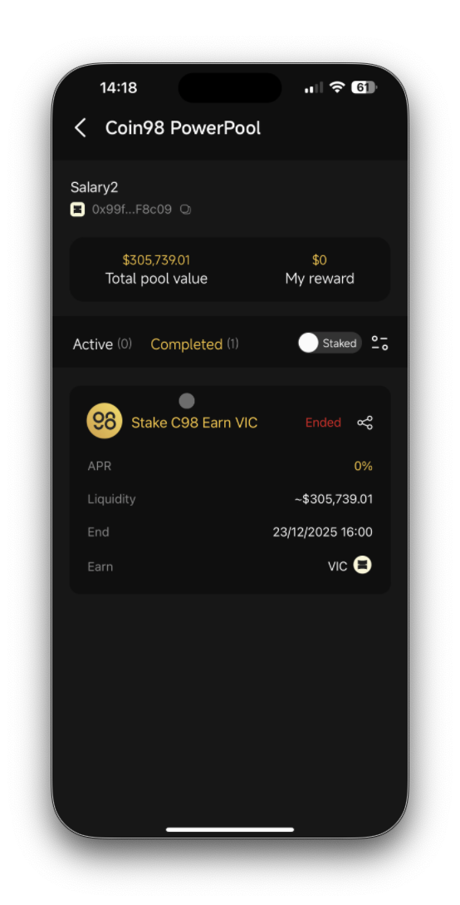
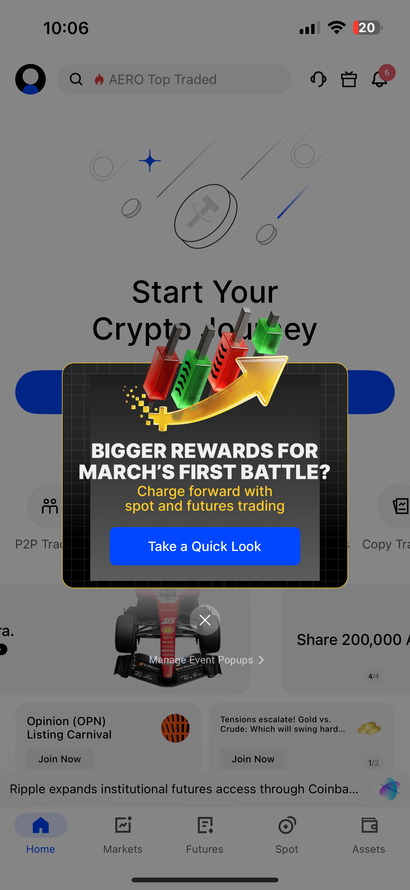
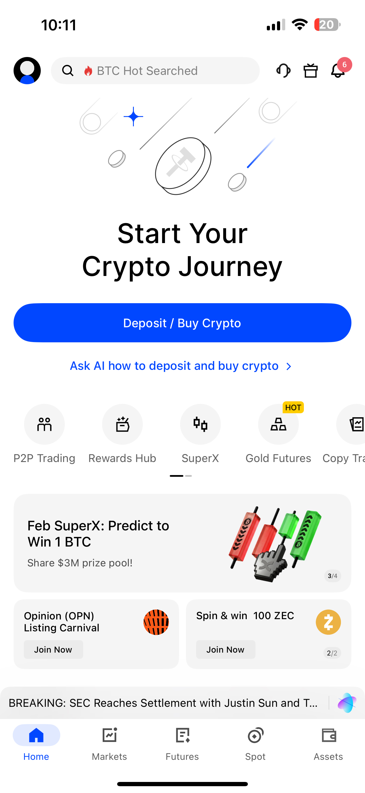
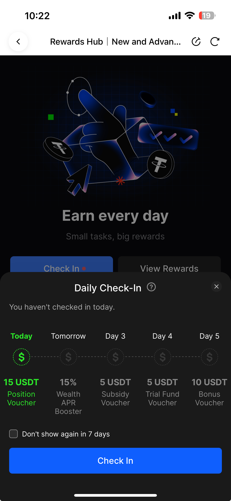
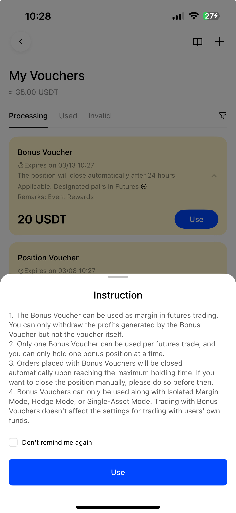
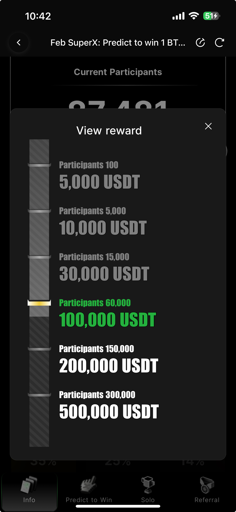

## Overview of Binance {#flywheel}
The overiew of Binance Cycle
<!-- 
 -->

<iframe src="binance.html" style="border:none; width:100%; height:70vh;" scrolling="no"></iframe>

---

## Ideas for Coin98 {#onboard}

1. **Learn to Earn**: For each new products/ partnerships. Additional to blogs, we have camp with quiz that rewards for each correct answer
2. **Earning Hub**: Instead of Stake Master for only NE's tokens, what if we aggregate all yields products into UI, abstracting away the providers?

---

## What triggers a user to use DeFi wallet app?

1. *Interact* with a Specific dApp or Protocol
2. Seeking *Higher Yields* or Passive Earning in DeFi
3. Participating in *Early Token Launches* or *Airdrops*
4. Self-Custody
5. Multi-Chain or Cross-Chain Activity
6. Privacy

---

## What are the pain points of users in crypto right now? {.small-text}

1. *Seed Phrase & Private Key Anxiety*: Fear of losing seed phrase. No recovery if lost
2. *Gas Fees Confusion*: Not understanding why need native token just to transact
3. *Multi-Chain Fragmentation*: Users must manually switch chains, bridge assets across networks, understand different explorers and token standards
4. *Security & scams* — Phishing, impersonation, approval drainers, social engineering; losses estimated $14-17B+ in recent years, with AI-enabled tactics rising
5. *Lack of confidence* — 59% of non-owners cite no protection, cyber risks; even owners face hacks, rugs, and trust erosion

---

## Pain points (cont.)
6. *UX & accessibility barriers* — Poor consumer-grade experiences, wallet setup friction, unclear value for everyday use
7. *Connecting wallet to malicious sites* and being hacked
8. *Failed Transactions* — Users don't understand why a transaction failed, why gas was deducted, or what error codes mean
9. *Asset Visibility Problems*: Users panic when tokens don't auto-display; They must manually add contract addresses
10. *Portfolio & PnL Tracking Difficulty*: No unified dashboard across chains; Hard to track cost basis

---

## What virtue should we strive for?
*What do users come to our wallet for?*

- Is it for earning? (Because we support different earning mechanism,...)
- Is it for security? (Support checking contracts, risk warning,...)
- Is it for Vietnamese service? (Deep integration in Vietnamese economy, services?)
- Is it for ease of use? (Easy to use, supporting features like easy earning,...)

> Being on user's top of mind for at least 1 virtue.

---

## What elements increase retention in app? {.small-text}

*If the user sees a specific benefit, the likelihood of returning to the tool increases*

- *Cumulative bonuses* for transaction frequency. Needless to be large, but regularity forms a habit. Rewards must be transparent and predictable.
- *Favorable conditions* when making specific transactions like paying bills, grocery,...
- *Privacy and security*. The user must be confident that their data is protected.
- *Education* such as educational materials, built-in prompts, and financial analytics.
- *Social component* — transfer funds within a family, collective savings, or support for local initiatives. Strengthening emotional attachment.

::: {.footer-note}
[Binance Square, March 2026](https://www.binance.com/en/square/post/292738653100098)
:::
---

## Binance

*How is Binance doing?*

---

## Binance Earn

*Offer wide variety of earn products, fit for beginner as well as advanced trader*

Classified into 2 types of earnings: **Simple Earn** and **Advanced Earn**.

**Simple Earn** — Low risk, low yield. Deposits are protected by Binance in token amount.

**Advanced Earn** — High risk, high return. Including *Dual Investment, Smart Arbitrage, On-Chain Yields and Discount Buy*.

---

## Simple Earn {.scrollable}

*Straightforward, real-time, and safe*

*Mechanism*: User lends Binance principal, Binance uses that money for internal operations. Users earn rewards, calculated as **APR**.

- Low risk, easy to withdraw, protected in token terms, easy for beginner.
- Profit updates everyday, trigger users to check balance
- Offer **different tokens** with different APRs, some could be high (from 2-10%)

*Why this increases retention?* This could be marketed as the easiest, lowest risk for beginners to earn in crypto.

::: {.columns}

::: {.column width="50%"}
{width=100%}
:::

::: {.column width="50%"}
{width=100%}
:::

:::

---

## Simple Earn: Types of product

*Fit different needs*

| Feature | Flexible Products | Locked Products |
|---|---|---|
| **Liquidity** | Withdraw anytime | Locked fixed period |
| **APR** | Lower, market dependent | Higher, 2-10x more |
| **Best for** | Emergency access | Higher yield seekers |
| **Redemption** | Almost instant | After lock period ends |

---

## Reflect on Coin98

[Binance / Earn / Simple]{.pill .golden}

*Can Coin98 be that wallet that users come for easy earning?*

**Coin98 PowerPool** is the most similar to Binance earn, but only focus on NE's token, and has stopped earning.

*What if* we collab with different lending/ liquidity protocols, acting as a abstracting, reliable central hub for users to earn? That way we can hook up new user with this no-risk earning feature.

---

## Advanced Earn {.small-text}

[Binance / Earn / Advanced]{.pill .golden}

*Maximize earnings for corresponding risks. Suited for advanced traders*

**Dual Investment**: High yield product — buy low or sell high at desired price and date, while earning rewards no matter which direction the market goes.

**Smart Arbitrage**: Arbitrage between perpetual futures and spot equivalents, leveraging the funding rate mechanism.

**Discount Buy**: Buy cryptocurrency at a discount or earn rewards on your investment.

**On-chain Yields**: Participate in various on-chain protocols and earn rewards directly through Binance account.

---

## Key Differences: Simple vs Advanced {.dense}

| Feature | Simple Earn | Advanced Earn |
|---|---|---|
| **Target** | Beginners, passive earn | Experienced traders |
| **Risk** | Low — principal protected | Medium to High |
| **Returns** | Predictable APR (1–10%) | Higher (10–50%+ APR) |
| **Liquidity** | Flexible or fixed periods | Often fixed settlement |
| **Complexity** | Very low — deposit & earn | Need strategy knowledge |

---

## "Learn & Earn"

[Binance / Learn]{.pill .golden}

*Earn while learning*

*Mechanism*: Sign up account → pass KYC → complete courses → pass quiz → rewarded with a token voucher. $2 - $10/course.

*Time & amount limited*. After program ends, user can still learn but not earn any rewards.

*Idea*: Instead of writing blogs to introduce partners/features → *What if* we convert the blogs into short courses? User earn if finish quiz → Deeper interactions than blogs.

---

## Launchpool, Megadrop, and Alpha Programs {.small-text}

[Binance / Earn]{.pill .golden}

- *Launchpool*: Stake BNB/FDUSD/USDC → *Earn* new project tokens proportionally. Unlock anytime.
- *Megadrop*: Lock BNB in Simple Earn + Complete quests → *Earn* airdrops from early Web3 projects.
- *Alpha (Points)*: Earn daily points via balance tiers + trading volume → *Earn* exclusive airdrops, TGEs, Alpha Box.
- *Idea*: Stake/hold/trade → Free early tokens → More activity → Loyalty & retention.

---

## Launch Programs: How is Coin98 doing? {.small-text}

[Binance / Earn]{.pill .golden}

- We have applied this tactic to launch different tokens (*Holder Airdrop* for DADA, ONEID, DEF; and *Starship*).
- But we could not keep these projects going, and the price keeps dumping → erode trust.
- *Current Cycle*: Low user base → Only low-quality projects → Poor launches → Price dumps → Users see scams → Trust erodes → User base shrinks further → **We need to break this cycle**

---

## How to reverse it {.warm}

*Prioritize quality + trust + sustainable incentives*

1. **Raise Launch Bar**: Only source quality projects
2. **Points > Simple airdrops**: Reward activity/loyalty
3. **Locks & vesting**: Prevent instant rugs

---

## Referral Program {.small-text}

[Binance / Earn]{.pill .golden}

**Referral Lite**: Simple one-time bonuses.

- Friend signs up + buys >$50 crypto + trades >$100. **Both** get up to **$100** rebate. Up to **$1,000** total.

**Referral Pro**: Ongoing passive income.

- Earn up to **50%** commission on friends' trading fees.
- Share up to **20%** fee discount with friend.
- Commissions paid hourly.

---

## Rewards Hub {.scrollable}

*Mechanism*: Complete different tasks in-app to earn rewards

*Rewards*: Rewards as vouchers, can be used in different products (Perps, Margin,...)

**Daily Airdrop**

[Binance / Tasks / Daily]{.pill .golden}

**Mechanism**: Daily tasks, reset daily, increase engagement

- Trade cumulative 100 USDT any token in Spot
- Trade cumulative 100 USDT any token in Future
- Trade cumulative 100 USDT any token in Convert
- Refer a friend to register and complete KYC
- Maintain minimum 300 USDT balance in Spot Wallet

**Rewards**: Airdrop Points
**CreatorPad and Binance Square Rewards**

Users (especially creators) can unlock token rewards by participating in content creation, engagement, or campaigns on Binance Square. This fosters community activity and retention through incentives.

---

## Overall {.earth}

Binance frequently launches time-limited campaigns, airdrops, token vouchers, and yield opportunities (e.g., via Launchpool or specific asset subscriptions) to boost engagement. Many of these are accessible via the Binance app/website under sections like Earn, Square, Activity, or Announcements.

---

# BingX

---

## Opening App {.scrollable}
Upon opening app, March event shows up in a pop-up notification

{width=100%}

Main screen also have banner for ongoing events

{width=100%}

---

## What are current events of BingX
- Complete tasks to claim token airdrop (ESP)
  - Future Trading Volume
  - Spot Trading Volume

---

## Shards Program {.scrollable}
*Core gamified loyalty and retention system on BingX Spot trading*

*Mechanism*: Shard is like badge, user earn to up level and perks. How to earn?
- Completing KYC verification, 
- making deposits (e.g., first deposit ≥50 USDT), 
- Spot trading (cumulative volume thresholds, daily check-ins with minimal trades, unlocking treasure boxes via trading), 
- Participating in events/campaigns, 
- Referring friends (invites who sign up and trade), 
- daily logins, social tasks, and limited-time promotions,...

*Benefits and rewards*: Higher Shard totals advance user levels, granting tiered perks such as:
- Trading fee discounts/rebates.
- Exclusive/high-value token airdrops.
- Priority/early access to Token Generation Events (TGEs) or popular tokens.
- Wealth APR booster vouchers.
- VIP upgrade benefits or privileges.
- Leaderboard rewards, annual honorary badges.
- Premium merchandise.
- Dedicated customer service.
- Other surprises like event passes or bonus yields.

---

## VIP Program {.scrollable}

*Tiered loyalty club for active/high-volume traders, rewarding sustained contributions with premium benefits.*

*Levels*: From VIP 1 to Supreme VIP (plus regular users), based on futures/spot trading volume, asset holdings, or other thresholds.

*Key benefits*:
- Significantly reduced trading fees
- 0 slippage on futures (guaranteed price orders, trigger orders).
- Higher 24h withdrawal limits.
- Discounted fiat exchange/convert rates.
- High-APR wealth products (e.g., up to 13% on short-term USDT).
- Boosted Launchpool staking limits (e.g., +100%).
- Dedicated relationship managers (1-on-1 support).
- Exclusive events (e.g., offline gatherings).

---

## Rewards Hub {.scrollable}

New User Zone (often time-limited post-signup, e.g., 21 days): Sign-up mystery boxes (5-30 USDT), KYC/deposit/trade tasks, exclusive challenges (e.g., 2-day futures trading volume ≥2,000 USDT daily for up to 700 USDT vouchers).
Advanced Zone (for existing users): VIP restoration (up to 3,500 USDT cash), trading volume milestones for vouchers/tokens, trending events/prize pools (e.g., $150,000 pools).
Vouchers/types: Position, token, bonus, trial fund, copy trading subsidies—many usable as margin or withdrawable profits after conditions.
Retention element: Cumulative trading tasks, daily/ongoing challenges, limited slots (first-come-first-served), and manual claims encourage repeated logins and activity.

### Daily Checkin
- Each check-in cycle lasts 5 days. Cycle reset after 5 days
- Cycle reset if missing 1 day
- Random rewards (not always vouchers), but there always a rewards

{width=50%}

### Rewards
- Voucher to use in Futures
- **Notice**: User can only withdraw profits from the position, but cannot withdraw the voucher money itself. *Can we do the same with Coin98?*
{width=50%}

---

## Feb SuperX: Predict to win 1 BTC{.scrollable}

{width=100%}

Consists of **Predict to Win**, **Solo Contest**, **Referral Contest**, and **Share & Earn** (social sharing/tasks)

 

### Predict to Win (BTC Daily Prediction)
- Users make daily predictions on BTC's price trend (e.g., up/down or specific ranges) > Correct predictions earn entries or shares in the 1 BTC prize pool (distributed weekly or overall) > Additional rewards include mystery boxes or vouchers for participation.
- **low-barrier**: no high trading volume required—just accurate market calls.
- **Rewards**: Share of 1 BTC (e.g., weekly portions like 0.18 BTC mentioned in some updates) + other vouchers. 
- **Goal**: Encourages daily logins and market analysis, boosting platform stickiness.

### Solo Contest (Trading Competition)
*A leaderboard-based contest split into phases, rewarding top performers in futures and spot trading*
Leaderboards:
- **Futures ROI (Return on Investment)**: Top ranks based on percentage ROI formula → [(Withdrawals + End NAV - Other Earnings - (Initial NAV + Deposits)) / (Initial NAV + Deposits)]. Requires min. 100,000 USDT trade volume.
Futures Trade Volume: Cumulative valid futures volume (crypto pairs only). Min. 1 USDT volume.
Spot Trade Volume: Cumulative spot volume (excludes stablecoin/zero-fee pairs). Min. 50 USDT volume.

 

### Referral Contest

- Invite new users who register, complete KYC/trade, and meet volume requirements.
- Rewards: Top 1–10 get Trial Fund Vouchers; ranks 11+ get Position Vouchers (10x leverage).
- Ties into BingX's ongoing referral program for uncapped commissions.

| **Event**                | **Prize Pool**   | **Time (UTC+8)**                                                                                                                                            | **Introduction**                                                                                                            |
| ------------------------ | ---------------- | ----------------------------------------------------------------------------------------------------------------------------------------------------------- | --------------------------------------------------------------------------------------------------------------------------- |
| **Predict BTC**          | 1 BTC + $200,000 | 2026-02-26 00:00 to 2026-03-17 23:59                                                                                                                        | Complete tasks to receive a voting entry and a mystery box. Participants with correct predictions share a 1 BTC prize pool! |
| **Solo Trading Contest** | $2,567,000       | Registration: 2026-02-26 00:00 to 2026-03-17 18:00    Phase I: 2026-03-04 00:00 to 2026-03-10 18:00    Phase II: 2026-03-11 00:00 to 2026-03-17 18:00 | Three leaderboards are now live: Futures Volume, ROI, and Spot Volume. Rewards can be stacked.                              |
| **Referral Contest**     | $155,500         | 2026-02-26 00:00 to 2026-03-17 23:59                                                                                                                        | Invite 1 person to share the prize pool!                                                                                    |
| **Share & Earn**         | $77,500          | 2026-02-26 00:00 to 2026-03-17 23:59                                                                                                                        | Share the event on your social media to claim the reward.                                                                   |

---

## BingX Retention Program {.scrollable}



### 1. BingX Shards Loyalty Program
*Long-term retention program*

**How it works**

* Users earn **Shards points** by:

  * KYC verification
  * Depositing funds
  * Trading
  * Completing tasks
  * Participating in campaigns
  * Inviting new users
* Accumulated Shards determine the **user’s level and status** on the platform

**Retention mechanisms**

* Gamified leveling system
* Continuous engagement tasks
* Status-based benefits

**Rewards unlocked**

* Token airdrops
* Early access to token launches (TGE)
* Trading fee discounts
* VIP privileges
* APR boosters and special wealth products
* Event passes and merchandise

This program is designed as an **ongoing engagement ecosystem rather than a one-time promotion**. 

 

### 2. Rewards Hub (Daily & Task-Based Incentives)
*Central engagement system for both new and existing users.*

**Key retention features**

* Daily check-in rewards
* Mystery boxes containing:

  * trading bonuses
  * rebate vouchers
  * trial funds

* **Task-based missions** such as trading volume or feature usage.

**Example tasks**
- Weekly spot trading volume targets
- Platform activity missions
- Campaign participation

This system encourages **habitual platform usage** (daily logins + trading activity).

 

### 3. **VIP Program + Monthly Airdrops**
*VIP-tier incentives tied to trading activity.*

**Examples of ongoing benefits**

* Monthly airdrop distributions
* Trial funds (e.g., 300 USDT trading vouchers)
* Hot token airdrops
* APR booster vouchers
* Fee subsidies for fiat-to-crypto conversions. ([bingxservice.zendesk.com][4])

The rewards often scale based on **VIP level**, motivating users to maintain high trading volume.

 

### 4. **New User + Trading Challenge Rewards**
*onboarding incentives that transition into retention programs*

Examples include:

* Mystery box rewards for completing beginner tasks
* Trading challenges with reward pools
* Bonus funds for first trades

Some campaigns offer **up to ~12,100 USDT rewards** through task completion and trading activities. ([CoinCodeCap][5])

These programs push users from **signup → active trading**.

 

### 5. **Referral / Affiliate Programs**
*Network-based incentives*

Examples:

* Referral commissions
* Affiliate/KOL reward campaigns
* Copy trading recommendation rewards

These programs reward users for **bringing new traders and maintaining trading activity**. ([Bingx Exchange][6])

 

### 6. **Copy Trading Ecosystem Incentives**
*Core feature that increase retention*

* Copy trading subsidy vouchers
* Trader recommendation rewards
* Profit-sharing programs for elite traders

These incentives encourage users to **stay engaged with the social trading ecosystem**.

---

## Summary: BingX Retention Flywheel

Most of BingX’s retention strategy can be grouped into **four engagement layers**:

| Layer                | Retention Mechanism      | Example            |
| -------------------- | ------------------------ | ------------------ |
| Gamification         | Points & leveling        | Shards             |
| Habit formation      | Daily tasks              | Rewards Hub        |
| Financial incentives | Trading rewards          | VIP airdrops       |
| Network effects      | Referrals & copy trading | Affiliate programs |

BingX relies heavily on **gamified rewards + trading incentives + social trading network effects** to retain users rather than only deposit bonuses.

[1]: https://bingx.pro/en/blog/article/bingx-shards-a-new-rewards-ecosystem-for-enhanced-user-engagement?utm_source=chatgpt.com "BingX Shards: A New Rewards Ecosystem for Enhanced User Engagement"
[2]: https://bingx.com/en/blog/article/what-are-bingx-shards-and-how-to-redeem-exclusive-rewards?utm_source=chatgpt.com "What Are BingX Shards and How to Redeem Exclusive Rewards?"
[3]: https://bingxservice.zendesk.com/hc/en-001/articles/11274682126479-BingX-Rewards-Hub-Rules?utm_source=chatgpt.com "BingX Rewards Hub Rules – BingX"
[4]: https://bingxservice.zendesk.com/hc/en-001/articles/14044996418959-BingX-Completes-October-2025-10-01-to-2025-10-31-Monthly-Airdrop-Reward-Distribution?utm_source=chatgpt.com "BingX Completes October (2025-10-01 to 2025-10-31) Monthly Airdrop Reward Distribution – BingX"
[5]: https://coincodecap.com/bingx-rewards?utm_source=chatgpt.com "BingX Rewards Hub 2025 – Earn 12,100+ USDT NOW! (July 2025) - CoinCodeCap"
[6]: https://blog.bingx.com/events/bx-affiliate-contest-exclusive/?utm_source=chatgpt.com "BX Affiliate Contest - Exclusive $23,000 Prize Pool For BingX Partners - BingX Blog"
[7]: https://uat-tr.bingx.com/support/articles/11273694355343?utm_source=chatgpt.com "BingX Global Broker Hunt Program 3.0: Upgraded Rewards & Massive Resources for Exposure!"
